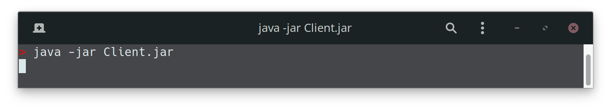

# Software engineering project

---

### 

## Satisfied requirements

---

- **Full ruleset**

- **Command Line Interface**

- **Graphic User Interface**

- **Socket connection**

- **First AF: Advanced Gods**

- **Second AF: Multiple** 

## Tests coverage

---

### Model Tests Coverage


### Complete Tests Coverage


As requested, we deeply tested our Model with particular attention to God's package. Where it was necessary and in edge cases we also tested the other packages, focusing on the network interaction.

## How to run Server and Client

---

In our Deliverables Folder, there are two files named Server.jar and Client.jar.

#### Server

The server can start both with default port number (13300) or with a custom port inserted as a parameter. To run the Server you need to open a terminal window, move to the folder with the file Server.jar and execute the command 

```bash
java -jar Server.jar [PORT]
```

If a valid port number is inserted, you will use it as port number for you server, if the port number isn't valid, you will be prompted with an error message, and finally if there isn't the port number parameter, the server will start with the default value (13300) .  You can find some examples at the end of this paragraph.

##### Client

The Client.jar file can start both the CLI and the GUI. 

###### CLI

To run the CLI version of the client, you need to open a terminal window, move to the folder with the file Client.jar and execute the command

```bash
java -jar Client.jar cli [IP] [PORT]
```

If a valid IP address and a valid port number are inserted, the client will start in the terminal, otherwise, you will be prompted with an error message. It's also possible to omit the port number and insert only the IP address. If the IP address nor the port number are inserted, the client will start with the default values (IP = 127.0.0.1, PORT = 13300). You can find some examples at the end of this paragraph.

###### GUI

Is possible to run the Client with the GUI by simply double-click on the jar file from a file manager, or otherwise, as for the CLI,  you can open a terminal window, move to the folder with the file Client.jar and execute the same command without any parameter

```bash
java -jar Client.jar
```

In both cases, a window with a login screen will pop up.

From the Login screen you can click the "Configure" button and insert the IP address and the port used by the server or just ignore it and use the default values (IP = 127.0.0.1, PORT = 13300). You can find some examples at the end of this paragraph.

###### Examples

Run the Server with default port number


Run the Server with custom port number


Run the Client with CLI and default IP address and port number


Run the Client with CLI, custom IP address and default port number


Run the Client with CLI and custom IP address and port number


Run the Client with GUI



Configure the Client - step 1: Click "Configure" button


Configure the Client - step 2: Insert a valid IP address and click "OK"


Configure the Client - step 3: Insert a valid port number and click "OK"


